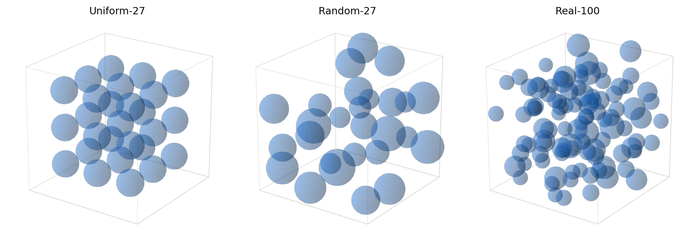
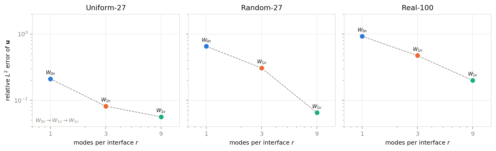
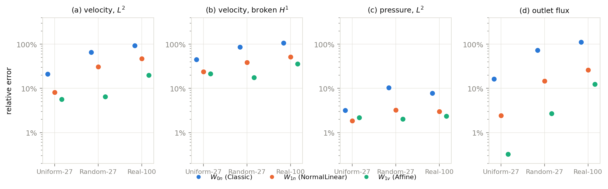
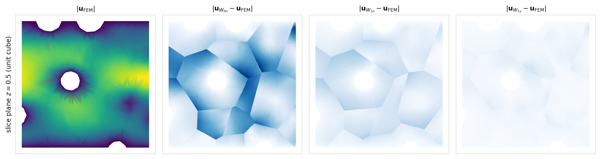
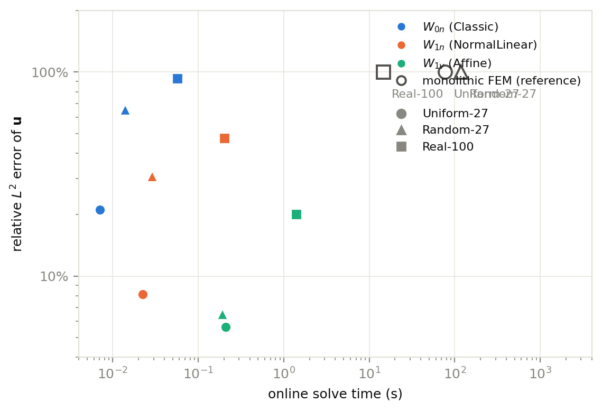
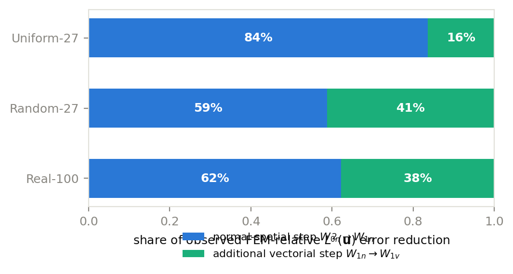
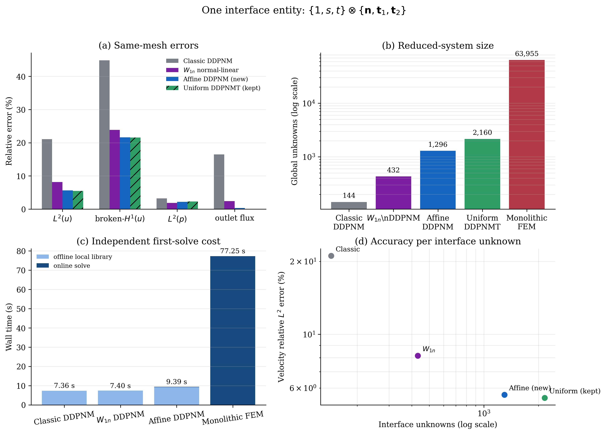

# Numerical Experiments

## Geometry-Dependent Modal Requirements of Finite-Area Interface Representations in Affine-DDPNM

*Intended for §6–§10 of the full paper — compiled from the archived benchmark outputs of 2026-08-10.*

> **Scope and honesty conventions.** This section reports exclusively results that were actually
> computed by the benchmark pipelines archived under `outputs/benchmark_w1n` of the three geometry
> projects (`affine_ddpnm_3d`, `affine_ddpnm_3d_random_porous`, `real_porous_benchmark_3d`). Two
> reference systems are distinguished throughout (physical FEM reference versus the theoretical
> broken-pressure C-DD reference); only the former was numerically available, and the distinction is
> respected in the wording. Items of the planned experimental programme that have *not* been run yet
> are explicitly listed in §10.3 and are *not* filled in with numbers. Where a speedup is reported,
> its exact timing scope (first solve vs. online only) is stated.

---

## 6. Numerical methodology

### 6.1 Geometries and discretisations

Three three-dimensional test geometries are used. All are unit-cube packings of solid spheres with
Stokes flow in the remaining fluid domain, partitioned into $N_p$ pore subdomains with $m$ planar
internal interfaces.

(i) **Uniform-27**: a regular $3\times3\times3$ lattice of 27 equal spheres (radius 0.105) centred
at $\{0.20,0.50,0.80\}^3$. The partition is the regular $4\times4\times4$ grid cut, giving
$N_p = 64$ pores and $m = 144$ interfaces (mean $2m/N_p = 4.5$ ports per pore).

(ii) **Random-27**: a frozen random packing of 27 spheres (seed 20260804, 18 wall-clipped and 9
interior spheres); the partition is the Voronoi tessellation of the sphere centres, giving
$N_p = 27$ pores and $m = 114$ interfaces (mean 8.44 ports per pore).

(iii) **Real-100**: a frozen random packing of 100 spheres (seed 20260805) with porosity 0.856; the
partition is the regular $4\times4\times4$ grid cut, giving $N_p = 64$ pores and $m = 144$
interfaces (mean 4.5 ports per pore).

The solid-phase packings are shown schematically in Fig. 1 (the finite-element meshes themselves are
not rendered; the sphere positions and radii are those used to build the meshes). Mesh statistics are
summarised in Table 1, including the objective variability descriptors suggested by the review of the
experimental design:

$$\operatorname{CV}(A_\gamma) = \frac{\operatorname{std}(A_\gamma)}{\operatorname{mean}(A_\gamma)},
\qquad \operatorname{CV}(V_i) = \frac{\operatorname{std}(V_i)}{\operatorname{mean}(V_i)},
\qquad \operatorname{CV}(a_\gamma/b_\gamma) = \frac{\operatorname{std}(a_\gamma/b_\gamma)}{\operatorname{mean}(a_\gamma/b_\gamma)},$$

where $A_\gamma$ is the area of interface $\gamma$, $V_i$ the volume of pore $i$, and
$a_\gamma/b_\gamma \ge 1$ the in-plane aspect ratio of the interface patch, estimated as the square
root of the ratio of the two largest principal-component eigenvalues of the patch vertices. These are
*reported* as descriptive quantities; no claim is made that a single scalar controls the error.

**Fig. 1.** Schematic of the three solid-phase packings used to build the test geometries (sphere
positions and radii as used by the mesh generator; finite-element meshes are not shown):
(a) Uniform-27 regular $3\times3\times3$ lattice; (b) Random-27 frozen packing of 27 spheres;
(c) Real-100 frozen packing of 100 spheres.

**Table 1. Geometry and discretisation summary.** FEM DOF counts are for the monolithic
Taylor–Hood pair $[P_2]^3$–$P_1$ (velocity DOFs = $3\times$ number of P2 nodes; pressure DOFs =
number of P1 nodes); they match the mixed-unknown counts reported by the solver.

| Geometry | spheres | $N_p$ | $m$ | cells | vel. DOFs | pres. DOFs | mixed DOFs | $2m/N_p$ | remarks |
|---|---|---|---|---|---|---|---|---|---|
| Uniform-27 | 27 | 64 | 144 | 12 203 | 60 936 | 3 019 | 63 955 | 4.5 | regular lattice |
| Random-27 | 27 | 27 | 114 | 15 249 | 72 471 | 3 483 | 75 954 | 8.44 | Voronoi, irregular |
| Real-100 | 100 | 64 | 144 | 32 611 | 159 186 | 7 655 | 166 841 | 4.5 | grid cut, porosity 0.856 |

| Geometry | CV($V_i$) | CV($A_\gamma$) | CV($a_\gamma/b_\gamma$) | mean $a_\gamma/b_\gamma$ |
|---|---|---|---|---|
| Uniform-27 | 0.321 | 0.203 | 0.158 | 1.39 |
| Random-27 | 0.432 | 0.783 | 1.479 | 2.48 |
| Real-100 | 0.057 | 0.116 | 0.078 | 1.11 |

The three geometries cover a deliberately regular case (Uniform-27), a deliberately irregular case
(Random-27), and a realistic high-porosity packing (Real-100). Note that the Real-100 *partition*
(regular grid) has small variability descriptors; the irregularity of the *geometry* is carried by
the sphere positions and by the pressure coupling, not by the grid partition itself.

### 6.2 Reference systems and error metrics

Two reference systems must be kept distinct (see also the theory document):

(i) **Physical/numerical reference**: the monolithic Taylor–Hood finite-element solution
$\mathbf{u}_h^{\mathrm{FEM}}, p_h^{\mathrm{FEM}}$ on the *same* mesh, with continuous pressure across
pores. All reported accuracy metrics are relative to this reference. The theoretical section does not
establish equivalence between this system and the broken-pressure C-DD reference; the error relative
to the FEM solution is therefore reported as an *observed* accuracy measure, and no rate statement is
made about it from the theory.

(ii) **Theoretical Galerkin reference**: the broken-pressure C-DD trace solution
$\boldsymbol{\xi}^{\mathrm{CDD}}$ of the theory sections, and the Schur-energy seminorm
$\|\cdot\|_{\widehat{\mathbf{S}}^{uu}}$ it induces. The theory-level quantities
($\|\boldsymbol{\xi}^{\mathrm{CDD}}-\boldsymbol{\xi}_X\|_{\widehat{\mathbf{S}}^{uu}}$, the
Pythagorean decompositions) were *not* computed in the runs archived so far (the full C-DD solve was
not executed); they are discussed in §7.3 as planned verification, and no numerical values are
reported for them.

For each reduced space $X \in \{W_{0n}, W_{0v}, W_{1n}, W_{1v}\}$ we report, uniformly:

$$e_u^{L^2} = \frac{\|\mathbf{u}_X-\mathbf{u}_{\mathrm{FEM}}\|_{L^2(\Omega)}}{\|\mathbf{u}_{\mathrm{FEM}}\|_{L^2(\Omega)}},$$

$$e_u^{H^1_{\mathrm{br}}} = \frac{\left(\sum_i \|\nabla(\mathbf{u}_X-\mathbf{u}_{\mathrm{FEM}})\|_{L^2(\Omega_i)}^2\right)^{1/2}}{\left(\sum_i \|\nabla \mathbf{u}_{\mathrm{FEM}}\|_{L^2(\Omega_i)}^2\right)^{1/2}},$$

$$e_p^{L^2} = \frac{\|p_X-p_{\mathrm{FEM}}\|_{L^2(\Omega)}}{\|p_{\mathrm{FEM}}\|_{L^2(\Omega)}},$$

$$e_Q = \frac{|Q_X-Q_{\mathrm{FEM}}|}{|Q_{\mathrm{FEM}}|}, \qquad Q = \text{outlet volume flux}.$$

All error norms are evaluated cell-wise on the common mesh (broken domain), with degree-6
quadrature. The pressure gauge is fixed by Dirichlet pressure conditions at inlet ($p=1$) and outlet
($p=0$) in both the FEM and the reduced systems; the raw relative $L^2$ pressure error is reported
without mean alignment. For the Random-27 geometry an additional mean-aligned variant (the raw error
with the global mean pressure difference removed) is available and is reported there; the theory
gives no monotonicity of $e_p^{L^2}$ along the nested chains, so occasional non-monotone pressure
errors are not a discrepancy.

### 6.3 Four modal interface spaces

The numerical programme is organised around the four trace subspaces of the theory section, whose
per-interface contents are

$$W_{0n}: \{1\cdot\mathbf{n}\}, \qquad W_{0v}: \{1\cdot\mathbf{n},\; 1\cdot\mathbf{t}_1,\; 1\cdot\mathbf{t}_2\},$$
$$W_{1n}: \{1\cdot\mathbf{n},\; s\cdot\mathbf{n},\; t\cdot\mathbf{n}\},$$
$$W_{1v}: \{1,s,t\}\otimes\{\mathbf{n},\mathbf{t}_1,\mathbf{t}_2\},$$

where $(s,t)$ are local planar coordinates on the (representative) interface and
$\{\mathbf{n},\mathbf{t}_1,\mathbf{t}_2\}$ a fixed orthonormal frame. Table 2 lists the unknown
budgets. The two three-mode spaces satisfy $\dim W_{0v} = \dim W_{1n} = 3m$, which makes them an
*equal-budget* pair: the same number of interface unknowns spent on directional content ($W_{0v}$)
versus on first-order spatial content ($W_{1n}$). Of the two paths
$W_{0n}\subseteq W_{0v}\subseteq W_{1v}$ and $W_{0n}\subseteq W_{1n}\subseteq W_{1v}$, only the
second was executable with the implemented bases at the time of the archived runs; $W_{0v}$
(constant tangential modes) is listed as *not computed* in this study.

**Table 2. The four modal interface spaces and their global unknown budgets** on the three geometries
($m$ = 144/114/144). The row marked † was *not computed* in the runs archived so far.

| Method | space/interface | modes/iface | Uniform-27 | Random-27 | Real-100 |
|---|---|---|---|---|---|
| Classic | $W_{0n}$ | 1 | 144 | 114 | 144 |
| P0-vector† | $W_{0v}$ | 3 | 432 | 342 | 432 |
| NormalLinear | $W_{1n}$ | 3 | 432 | 342 | 432 |
| Affine | $W_{1v}$ | 9 | 1296 | 1026 | 1296 |

Per-interface contents: $W_{0n}=\{1\mathbf{n}\}$; $W_{0v}=\{1\mathbf{n},1\mathbf{t}_1,1\mathbf{t}_2\}$;
$W_{1n}=\{1\mathbf{n},s\mathbf{n},t\mathbf{n}\}$;
$W_{1v}=\{1,s,t\}\otimes\{\mathbf{n},\mathbf{t}_1,\mathbf{t}_2\}$. † Constant-vector (P0-vector)
space: basis implemented as part of the four-space framework but not run in the archived benchmarks;
included for the equal-budget comparison planned in §8.4.

### 6.4 Timing and solver protocol

All runs used the same serial pipeline on one machine (Windows 11, x86-64; the fenicsx environment;
viscosity 1, inlet/outlet pressure 1/0). Timings distinguish

$$T_{\mathrm{offline}} = \text{local factorisations and primitive response construction},$$
$$T_{\mathrm{online}} = \text{global reduced assembly + Schur solve + local reconstruction}.$$

$T_{\mathrm{first}} = T_{\mathrm{offline}} + T_{\mathrm{online}}$ is the wall time of a first
reduced solve. The FEM comparison time is the monolithic assembly+solve. Common mesh generation and
post-processing validation are excluded from both. Where a "speedup vs FEM" is quoted, the scope is
stated: for Uniform-27 and Random-27 it is
$T_{\mathrm{first}}(\mathrm{FEM})/T_{\mathrm{first}}(X)$ (a genuine wall-clock speedup including
the offline library); for Real-100 the offline cost dominates a single solve and only the
online-phase ratio is quoted, together with the absolute times.

---

## 7. Verification of the reference implementation

### 7.1 Exact-FE-Schur: Schur elimination code validation

On Random-27 the benchmark additionally solves the exact Schur complement of the monolithic system
on the full FE interface trace (21 970 trace DOFs, 465.9 s). This serves as a code-level validation
of the Schur-elimination machinery, *not* as the theoretical C-DD reference: the two systems share
the assembled monolithic operator and must agree to round-off. The measured relative difference
between the exact-FE-Schur solution and the monolithic solve is

$$\frac{\|\mathbf{u}_{\mathrm{Schur}}-\mathbf{u}_{\mathrm{direct}}\|}{\|\mathbf{u}_{\mathrm{direct}}\|} = 1.05\times10^{-12},$$

with Schur symmetry defect $3.2\times10^{-15}$, Schur relative residual $5.75\times10^{-14}$ and
global relative residual $1.55\times10^{-15}$. The reduced spaces therefore face a validated
reference: their errors relative to the exact Schur solution (column "errors to exact FE-Schur" in
the archived report) equal their errors relative to the monolithic solve to 12 digits, confirming
that no implementation error is introduced by the reduced-space coupling itself.

### 7.2 Conservation and algebraic diagnostics

Table 3 collects the algebraic diagnostics recorded by the runs. Local mass conservation is enforced
by construction (the interface P0 flux equations are assembled exactly); the residuals shown are the
maximum absolute momentum-residual entries of the assembled Schur systems, at round-off level in all
cases. The Schur matrices are exactly symmetric by construction (symmetry defect zero for the reduced
systems). On Random-27 the minimum Schur eigenvalue drops from $2.1\times10^{-8}$ (Classic) to
$1.26\times10^{-12}$ for both NormalLinear and Affine: the three-mode and nine-mode Schur systems are
SPD but very ill-conditioned on this geometry; this is a conditioning observation only, no claim
about solvability is implied beyond the successful solves.

**Table 3. Numerical verification diagnostics** as recorded by the archived runs ("—" = not recorded
by that benchmark). "max r_mom" is the maximum absolute momentum residual of the assembled reduced
system; the mass-balance row is the inlet/outlet flux sum of the random benchmark.

| Geometry | Method | max\|r_mom\| | Schur sym. defect | λ_min(S) | in/out flux sum |
|---|---|---|---|---|---|
| Uniform-27 | all | — | — | 1.67e-4 † | — |
| Random-27 | $W_{0n}$ | 2.17e-16 | 0 | 2.11e-8 | −5e-16 |
| Random-27 | $W_{1n}$ | 3.55e-16 | 0 | 1.26e-12 | −2e-16 |
| Random-27 | $W_{1v}$ | 4.92e-16 | 0 | 1.26e-12 | −4e-16 |
| Real-100 | $W_{0n}$ | 6.36e-17 | 0 | — | — |
| Real-100 | $W_{1n}$ | 1.05e-16 | 0 | — | — |
| Real-100 | $W_{1v}$ | 1.45e-16 | 0 | — | — |

† Recorded by the base-project verification run (`ddpnm_3d_uniform_spheres`, same geometry, Classic
system); the affine benchmark did not record the eigenvalue. The monolithic FEM reference solves
reached relative linear residuals 1.73e-12 (Uniform-27) and 2.92e-12 (Random-27), with relative mass
imbalance 2.54e-14 (Random-27).

### 7.3 Theory-level verification: not yet computed

The theory sections derive the best-approximation property in the $\widehat{\mathbf{S}}^{uu}$-
seminorm and the exact Pythagorean decompositions along the two nested paths, with the reduction
errors $\Delta_T = \|\boldsymbol{\xi}_{0v}-\boldsymbol{\xi}_{0n}\|_{\widehat{\mathbf{S}}^{uu}}^2$,
$\Delta_N = \|\boldsymbol{\xi}_{1n}-\boldsymbol{\xi}_{0n}\|_{\widehat{\mathbf{S}}^{uu}}^2$, and the
identity

$$\|\boldsymbol{\xi}^{\mathrm{CDD}}-\boldsymbol{\xi}_{0n}\|_{\widehat{\mathbf{S}}^{uu}}^2 =
\|\boldsymbol{\xi}^{\mathrm{CDD}}-\boldsymbol{\xi}_{1v}\|_{\widehat{\mathbf{S}}^{uu}}^2
+ \|\boldsymbol{\xi}_{1v}-\boldsymbol{\xi}_{1n}\|_{\widehat{\mathbf{S}}^{uu}}^2
+ \|\boldsymbol{\xi}_{1n}-\boldsymbol{\xi}_{0n}\|_{\widehat{\mathbf{S}}^{uu}}^2,$$

and its analogue along $W_{0n}\to W_{0v}\to W_{1v}$. These identities are exact for nested spaces in
exact arithmetic and their numerical verification requires solving the *full* C-DD system (the
broken-pressure Galerkin solution $\boldsymbol{\xi}^{\mathrm{CDD}}$), which was not executed in the
archived runs. This verification is a planned item (see §10.3); the nestedness of the implemented
bases is however exact by construction, and the diagnostics of §7.1–§7.2 confirm that the assembled
reduced operators are consistent with the monolithic system to machine precision.

---

## 8. Controlled modal experiments

### 8.1 Absolute accuracy

Table 4 collects the complete accuracy results of all archived runs: 3 geometries × 3 computed
spaces, four metrics each. It is an absolute-results table (not improvement ratios).

**Table 4. Complete accuracy results** relative to the monolithic Taylor–Hood FEM on the same mesh.
$e_u^{L^2}$, $e_u^{H^1_{\mathrm{br}}}$, $e_p^{L^2}$, $e_Q$ as in §6.2. † mean-aligned pressure
variant (Random-27 only). The $W_{0v}$ row was not computed in the archived runs.

| Geometry | Method | $e_u^{L^2}$ | $e_u^{H^1_{\mathrm{br}}}$ | $e_p^{L^2}$ | $e_p^{L^2,\mathrm{align}}$† | $e_Q$ |
|---|---|---|---|---|---|---|
| Uniform-27 | $W_{0n}$ | 0.2108 | 0.4483 | 0.0321 | — | 0.1646 |
| Uniform-27 | $W_{1n}$ | 0.0816 | 0.2385 | 0.0185 | — | 0.0243 |
| Uniform-27 | $W_{1v}$ | 0.0563 | 0.2161 | 0.0217 | — | 0.0032 |
| Random-27 | $W_{0n}$ | 0.6532 | 0.8585 | 0.1030 | 0.2196 | 0.7272 |
| Random-27 | $W_{1n}$ | 0.3075 | 0.3897 | 0.0322 | 0.0694 | 0.1465 |
| Random-27 | $W_{1v}$ | 0.0651 | 0.1756 | 0.0203 | 0.0436 | 0.0271 |
| Real-100 | $W_{0n}$ | 0.9254 | 1.0627 | 0.0776 | — | 1.1199 |
| Real-100 | $W_{1n}$ | 0.4738 | 0.5129 | 0.0299 | — | 0.2595 |
| Real-100 | $W_{1v}$ | 0.1998 | 0.3594 | 0.0236 | — | 0.1244 |

Three observations follow directly from the absolute numbers, all qualitative and confined to the
tested configurations:

**(C1)** Constant-normal coupling is insufficient: on every geometry the Classic ($W_{0n}$) velocity
error is at least 21%, and grows to 65%–93% as the geometry departs from the regular lattice.

**(C2)** The first-order normal modes $W_{1n}$ remove the dominant part of that error on all three
geometries ($e_u^{L^2}$ drops by factors 2.6 / 2.1 / 2.0 for Uniform/Random/Real).

**(C3)** The additional vectorial content $W_{1v}$ remains significant for Random-27
($e_u^{L^2}$: 0.308 → 0.065) and Real-100 (0.474 → 0.200), while on Uniform-27 it is a smaller
correction (0.082 → 0.056). The flux error $e_Q$ on Uniform-27 drops to 0.32% only with $W_{1v}$.

The non-monotonicity of the pressure error on Uniform-27
($e_p^{L^2}(W_{1n}) = 0.0185 < e_p^{L^2}(W_{1v}) = 0.0217$) is not a discrepancy: the theory does not
guarantee monotonicity of the pressure $L^2$ error along nested chains (the reduction error is
monotone in the Schur-energy seminorm, not in $L^2(p)$).

### 8.2 Accuracy versus modal budget

Fig. 2 is the central visual of the section: for each geometry it plots the relative $L^2$ velocity
error against the number of modes per interface, $r \in \{1,3,9\}$, joining the points along the
computed nested path $W_{0n}\to W_{1n}\to W_{1v}$. The $r=3$ location carries a single computed
space ($W_{1n}$); the equal-budget companion $W_{0v}$ is not yet computed, so the question "same DOF
budget spent on direction versus on spatial variation" can only be posed here, not answered (see
§8.4).

**Fig. 2.** Relative $L^2$ velocity error versus modes per interface ($r = 1, 3, 9$) along the
nested path $W_{0n}\to W_{1n}\to W_{1v}$, for the three geometries (log scale). Only the path through
$W_{1n}$ was computed; the equal-budget space $W_{0v}$ at $r=3$ is planned work.

The diminishing-returns shape ($1\to3$ much larger than $3\to9$) is consistent across all three
geometries, while the *level* of the remaining error at $r=9$ differs strongly: 5.6%, 6.5%, 20%.
This visual supports the claim that the modal budget requirement is geometry-dependent, without
over-interpreting the exact values (no asymptotics in $r$ are claimed).

### 8.3 Metric comparison across geometries

Fig. 3 shows all four metrics as dot plots (velocity $L^2$, broken $H^1$, pressure $L^2$,
outlet-flux error) with logarithmic ordinate; the wide dynamic range (0.3%–112%) is the reason for
the log scale. The figure reproduces the Table 4 numbers in a form where the cross-geometry pattern
is visible at a glance: the Classic-to-Affine spread widens from the regular to the irregular and
realistic cases in every metric except the pressure error, which stays within one decade across all
geometries and methods.

**Fig. 3.** Four error metrics (relative, log scale) across the three geometries, three computed
spaces: (a) velocity $L^2$; (b) velocity broken $H^1$; (c) pressure $L^2$; (d) outlet-flux error.

### 8.4 Equal-budget comparison $W_{0v}$ vs. $W_{1n}$: planned

The central controlled contrast of the programme is the equal-budget comparison

$$G_{0v} = \frac{e_{0n}-e_{0v}}{e_{0n}}, \qquad G_{1n} = \frac{e_{0n}-e_{1n}}{e_{0n}},$$

i.e. the FEM-relative $L^2$ reduction obtained by spending three DOFs per interface on constant
directional content ($W_{0v}$) versus on first-order spatial content ($W_{1n}$). This experiment was
*not* run in the archived benchmarks (the constant-vector basis is implemented in the four-space
framework but no runs were executed). It is the first item of §10.3. Until it is computed, the
statement that the normal-linear modes are the dominant mechanism rests on the comparison
$W_{0n}\to W_{1n}\to W_{1v}$ alone (Fig. 2), which cannot separate directional from spatial
information.

### 8.5 Field visualization (Random-27)

Fig. 4 shows, on the Random-27 geometry, a slice plane ($z = 0.5$) of the FEM velocity magnitude
together with the pointwise velocity error magnitude of the three reduced spaces, on a common color
scale. The pattern matches the quantitative results: the Classic error field is concentrated at pore
throats and interface junctions, the NormalLinear space removes most of it, and the Affine space
reduces the residual further; at this slice the remaining Affine error is concentrated in a few
throat regions.

**Fig. 4.** Random-27, slice $z = 0.5$: FEM velocity magnitude (left) and pointwise velocity error
magnitude of $W_{0n}$, $W_{1n}$, $W_{1v}$ on a common color scale (blue = zero error). Error maps
share one scale; the reference panel has its own.

The archived slice data exists only for Random-27 (the Real-100 run could not write slice fields
because of the known `z_slice` interface mismatch, see the handoff document); field maps for the
other geometries are planned work.

---

## 9. Realistic porous structure (Real-100)

### 9.1 Accuracy

The Real-100 geometry is the largest and most realistic of the three (32 611 cells, 166 841 mixed
DOFs, porosity 0.856). Its accuracy rows in Table 4 repeat the qualitative pattern of the controlled
geometries, at a higher level: Classic $W_{0n}$ misses 92.5% of the velocity $L^2$ norm and even
overshoots in the broken $H^1$ seminorm ($e_u^{H^1_{\mathrm{br}}} = 1.063$); NormalLinear reduces
the $L^2$ error to 47.4% and the flux error to 25.9%; Affine reaches $e_u^{L^2} = 20.0\%$,
$e_Q = 12.4\%$. The pressure error is the least sensitive metric here as well (7.8% → 3.0% →
2.4%). These are the least accurate of the three geometries for every space, which is consistent
with the larger fluid volume and the more convoluted interface network, but no single descriptor is
claimed to explain the ordering.

### 9.2 Cost and memory

Table 5 reports the cost structure of all runs. For Uniform-27 and Random-27 the reduced methods
achieve a genuine first-solve speedup over the monolithic FEM (10.5× and 13.3× for Classic; 8.2× and
9.1× for Affine), because the offline library is cheap relative to the FEM solve on those meshes.
For Real-100 the situation is reversed: the monolithic solve takes 14.5 s while the reduced offline
phase takes 28–33 s, so a single reduced solve is *slower* in wall time than the FEM solve; only the
online phase is fast (0.06–1.4 s, i.e. 255×, 72×, 10× faster than the FEM solve). The table
therefore states absolute times for both phases and both references, and the speedup discussion is
confined to the stated scopes.

**Table 5. Computational cost (seconds).** $T_{\mathrm{offline}}$: local factorisations + primitive
responses; $T_{\mathrm{online}}$: reduced assembly + Schur solve + reconstruction;
$T_{\mathrm{first}} = T_{\mathrm{offline}} + T_{\mathrm{online}}$. FEM column = monolithic
assembly+solve. $N_{\mathrm{prim}}$ = primitive RHS columns. For Real-100, $T_{\mathrm{first}}$ is
the archived total; FEM there is the monolithic solve only.

| Geometry | Method | unknowns | $N_{\mathrm{prim}}$ | $T_{\mathrm{offline}}$ | $T_{\mathrm{online}}$ | $T_{\mathrm{first}}$ | speedup vs FEM |
|---|---|---|---|---|---|---|---|
| Uniform-27 | $W_{0n}$ | 144 | 320 | 7.35 | 0.0071 | 7.36 | 10.50× |
| Uniform-27 | $W_{1n}$ | 432 | 896 | 7.38 | 0.0222 | 7.40 | 10.44× |
| Uniform-27 | $W_{1v}$ | 1296 | 2624 | 9.18 | 0.208 | 9.39 | 8.23× |
| Uniform-27 | FEM | 63 955 | — | — | 77.25 | 77.25 | 1× |
| Random-27 | $W_{0n}$ | 114 | 246 | 8.90 | 0.0141 | 8.91 | 13.29× |
| Random-27 | $W_{1n}$ | 342 | 702 | 9.20 | 0.0287 | 9.22 | 12.84× |
| Random-27 | $W_{1v}$ | 1026 | 2070 | 12.82 | 0.191 | 13.01 | 9.10× |
| Random-27 | FEM | 75 954 | — | — | 118.42 | 118.42 | 1× |
| Random-27 | Exact-FE-Schur | 21 970 | — | — | 465.90 | 465.90 | 0.25× |
| Real-100 | $W_{0n}$ | 144 | — | 27.9 | 0.057 | 27.98 | 255× (online only) |
| Real-100 | $W_{1n}$ | 432 | — | 28.0 | 0.203 | 28.17 | 72× (online only) |
| Real-100 | $W_{1v}$ | 1296 | — | 32.7 | 1.400 | 34.13 | 10× (online only) |
| Real-100 | FEM | 166 841 | — | — | 14.53 | 14.53 | 1× |

Peak memory (Real-100 only): $W_{0n}$ 45.0, $W_{1n}$ 78.8, $W_{1v}$ 246.4, FEM 299.8 MiB. "Online
only" speedups are $T_{\mathrm{online}}(\mathrm{FEM})/T_{\mathrm{online}}(X)$; the absolute times
show that a single Real-100 reduced solve is slower than the FEM solve in wall time.

### 9.3 Accuracy–cost tradeoff

Fig. 5 plots, per geometry, the relative $L^2$ velocity error against the online solve time on
log–log axes, together with the monolithic FEM reference point. It answers the question "what
accuracy does the added modal information buy" in cost terms. For all three geometries the reduced
points lie on a clear accuracy–cost frontier above and to the left of the FEM point; the frontier is
strongly geometry-dependent (the Real-100 points at $r \ge 3$ remain above the Uniform-27 $r = 1$
error). The figure does *not* include the offline cost, which is the dominant part of
$T_{\mathrm{first}}$ on Real-100; it is shown because the online phase is the asymptotically
recurring cost in a many-query scenario, and the caption says so.

**Fig. 5.** Relative $L^2$ velocity error versus online solve time (log–log). Marker shape =
geometry; colour = space (blue $W_{0n}$, orange $W_{1n}$, aqua $W_{1v}$); hollow markers =
monolithic FEM reference. Online time excludes the offline library phase (see Table 5).

---

## 10. Cross-geometry modal analysis

### 10.1 Observed FEM-relative error-reduction shares

Along the computed path $W_{0n}\to W_{1n}\to W_{1v}$ the observed FEM-relative $L^2$ velocity-error
reduction decomposes into the normal-spatial step ($W_{0n}\to W_{1n}$) and the additional vectorial
step ($W_{1n}\to W_{1v}$):

$$R_N = \frac{e_{0n}-e_{1n}}{e_{0n}-e_{1v}}, \qquad R_{V|N} = \frac{e_{1n}-e_{1v}}{e_{0n}-e_{1v}}, \qquad R_N + R_{V|N} = 1.$$

Fig. 6 and Table 6 report these shares.

**Fig. 6.** Fractions of the *observed* FEM-relative $L^2$ velocity error reduction along the
prescribed path $W_{0n}\to W_{1n}\to W_{1v}$ (100% stacked). These fractions are descriptive; they
are not unique causal modal contributions, because the four middle spaces are generally non-nested
and the path choice fixes the attribution.

**Table 6. Cross-geometry modal summary:** absolute errors and the observed FEM-relative reduction
shares.

| Geometry | $e_{0n}^{L^2}$ | $e_{1n}^{L^2}$ | $e_{1v}^{L^2}$ | $R_N$ | $R_{V\|N}$ | reduction $(e_{0n}-e_{1v})/e_{0n}$ |
|---|---|---|---|---|---|---|
| Uniform-27 | 0.2108 | 0.0816 | 0.0563 | 83.6% | 16.4% | 73.3% |
| Random-27 | 0.6532 | 0.3075 | 0.0651 | 58.8% | 41.2% | 90.0% |
| Real-100 | 0.9254 | 0.4738 | 0.1998 | 62.2% | 37.8% | 78.4% |

Two statements can be made from these numbers, both confined to the tested configurations and to the
chosen path:

**(D1)** On all three geometries the normal-spatial step $W_{0n}\to W_{1n}$ accounts for the
majority of the observed reduction (59%–84%).

**(D2)** The share of the vectorial step $W_{1n}\to W_{1v}$ is markedly larger on the
irregular/realistic geometries (41% and 38%) than on the regular lattice (16%): the relative value
of the additional directional content increases with geometric irregularity as measured by the
variability descriptors of Table 1 (Random-27 has the largest CV($A_\gamma$) and
CV($a_\gamma/b_\gamma$)). This is an observed association, not a proven causal relation.

### 10.2 Schur-energy pathwise decomposition: planned

The theory sections give an *exact* decomposition of the squared Schur-energy error into pathwise
marginal gains (see §7.3). Unlike the FEM-relative shares of Fig. 6, those quantities
($\Delta_N$, $\Delta_{T|N}$ etc. in the $\widehat{\mathbf{S}}^{uu}$-seminorm) are theorem-level and
require the full C-DD trace solution $\boldsymbol{\xi}^{\mathrm{CDD}}$. They were not computed in
the archived runs and are therefore not reported numerically; Fig. 6 and the planned Schur-energy
figure must not be conflated. The former is an observed descriptive attribution, the latter would be
a strict theorem quantity; only the former is available at this stage.

### 10.3 Geometry dependence and limitations

**What the current data supports.**

(i) constant-normal coupling $W_{0n}$ is insufficient to represent the finite-area pore interfaces
accurately on any of the three geometries;

(ii) the first-order normal modes $W_{1n}$ provide a major correction on all three;

(iii) the residual gap between $W_{1n}$ and $W_{1v}$ is small on the regular geometry and substantial
on the irregular/realistic ones, so the effective low-dimensional modal requirement of an interface
*depends on the geometry across the tested configurations*;

(iv) no monotonic dependence of the error on a single scalar geometry descriptor is claimed.

**What is planned and not yet computed.**

(a) the equal-budget space $W_{0v}$ (constant tangential modes) on all three geometries, enabling
the controlled contrast of §8.4;

(b) the full C-DD solve $\boldsymbol{\xi}^{\mathrm{CDD}}$ on Uniform-27 and Random-27 for the exact
Schur-energy verification (§7.3) and the pathwise decomposition (§10.2);

(c) a mesh-sensitivity study (Uniform-27 at three mesh levels) to confirm that the separation
$W_{0n} \gg W_{1n} > W_{1v}$ is not an artifact of one mesh; the theory gives fixed-mesh separation
only, no mesh-independent asymptotic statement;

(d) an ensemble of random realisations of the Random-27 geometry to test the stability of the
59/41 split across seeds;

(e) slice-field outputs for Real-100 once the `z_slice` interface mismatch is fixed;

(f) a second real geometry at a different sphere count.

**Scope notes.** All timings are single-machine, single-threaded measurements from the archived
runs; they are indicative, not benchmark-suite grade. The reported errors are with respect to the
monolithic Taylor–Hood FEM on the same mesh; the relation between the broken-pressure C-DD
discretisation and the monolithic system is not established in the theory sections, and therefore no
claim about the accuracy of the reduced methods *relative to the exact Stokes solution* is made.

---

## Appendix A. Archived output provenance

All numbers in this section were produced by the archived benchmark runs of 2026-08-10 and are
stored in

- `affine_ddpnm_3d/outputs/benchmark_w1n/`:
  `affine_ddpnm_metrics.csv`, `affine_ddpnm_report.json`;
- `affine_ddpnm_3d_random_porous/outputs/benchmark_w1n/`:
  `random_affine_metrics.csv`, `random_affine_report.json`, `random_benchmark_fields.npz`;
- `real_porous_benchmark_3d/outputs/benchmark_w1n/`:
  `benchmark_metrics.csv`, `benchmark_report.json`;
- the base-project verification run `ddpnm_3d_uniform_spheres/outputs/verify_run/` (Classic Schur
  eigenvalue footnote).

Geometry descriptors were recomputed by the enclosed script (`scripts/geometry_stats.py`) directly
from the saved partition meshes (Uniform-27, Random-27) and by rebuilding the grid partition with
the benchmark's own builder (Real-100); the resulting `data/geometry_stats.json` accompanies this
section. All figures were regenerated from the CSVs/JSON above by `scripts/make_figures.py`; no
numbers were edited by hand beyond rounding to the significant digits shown.

## Appendix B. Archived benchmark plot (Uniform-27)

The benchmark pipeline itself produced the four-method comparison plot shown in Fig. A1 (errors,
speedup and offline time for the Uniform-27 geometry), which we reproduce here as the archival
artifact it is; its bar-chart form is kept exactly as generated, and the colour of the NormalLinear
series (#7B1FA2) follows the original run, not the palette of the new figures.

**Fig. A1.** Archived comparison plot generated by the Uniform-27 benchmark run itself
(Classic/W1n/Affine vs. FEM): relative errors (velocity $L^2$, broken $H^1$, pressure $L^2$, flux),
speedup and offline time. Reproduced unchanged.
