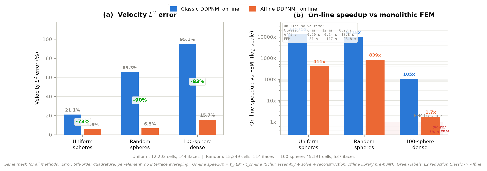

# DDPNM：域分解孔隙网络方法 — Classic 经典单模 → Affine 仿射九模态

> 三维 Stokes 流动的域分解方法（Domain-Decomposition Pore-Network Method）。
> 保持「不重叠子区域 + 局部 Stokes 响应库 + 全局界面 Schur 系统」框架不变，
> 将经典方法每个界面仅一个常数法向系数的界面空间，升级为
> **仿射九模态空间** `{1,s,t} × {n,t₁,t₂}`（s、t 为界面中心附近的无量纲面内坐标，
> 不是采样点），把三维多孔介质上的速度误差从 **21–95% 降到 5.6–15.7%**。



---

## 1. 核心成果

| 成果 | 数据 |
|---|---|
| 速度 L² 误差降低 | 均匀 27 球 **−73%**、随机 27 球 **−90%**、100 球密集堆积 **−83%** |
| 出口通量误差降低 | 均匀 **−98%**（16.5% → 0.32%）、随机 **−96%**（72.7% → 2.7%） |
| 在线求解加速 | 每工况（离线库建好后）：均匀 Affine **410×**、随机 Affine **840×** vs 整体 FEM |
| 首解加速 | 均匀 5.88×、随机 7.66× vs 整体 FEM（离线库 + 在线一次） |
| 正确性基线 | 精确 FE-trace Schur 与整体 FEM 解一致到 **1.05e-12**；守恒与界面矩残差全部舍入误差级 |

关键结论：**经典三维 DDPNM 的瓶颈是「每面一个常数法向系数」，不是「每面一个代表实体」**。
释放面内线性模态（无需增加采样点）即可消除大部分误差。

## 2. 方法

- **Classic-DDPNM**：每界面仅常数法向牵引模态 `1·n` —— 2D 上误差 5.17%，3D 随机介质上退化到 65–95%。
- **Affine-DDPNM**：每界面携带九模 `{1,s,t}×{n,t₁,t₂}` —— 面内线性速度与压力变化全部可表达。
- **离线/在线分离**：离线建局部响应库（`K_II⁻¹` 分解 + 界面响应列，逐界面一次）；在线仅装配稠密（当前实现）/稀疏 Schur 并求解 + 重构。在线成本即**每边界条件**的边际成本，是多工况场景的核心优势。
- **全局 Schur 装配强制 9 个加权矩连续**（流量、面内线性速度矩、切向应力矩）；质量残差与界面矩残差均达舍入误差级（详见 `ddpnm_core/assembler.py`）。

## 3. 三个三维基准算例

全部算例与整体 Taylor–Hood P2–P1 FEM 同网格严格比较，误差用六阶求积逐单元计算，局部 DD 场不做界面平均。

### 3.1 同网格误差（vs 整体 FEM）

| 几何（网格 / 分区） | Classic L²(u) | Classic H¹(u) | Classic L²(p) | Classic 通量 | Affine L²(u) | Affine H¹(u) | Affine L²(p) | Affine 通量 |
|---|---|---:|---:|---:|---:|---:|---:|---:|---:|
| 均匀 27 球（12,203 胞 / 64 子域 / 144 界面 / 63,955 DOF） | 21.1% | 44.8% | 3.2% | 16.5% | **5.6%** | 21.6% | 2.2% | **0.32%** |
| 随机 27 球（15,249 胞 / 27 子域 / 114 界面 / 75,954 DOF） | 65.3% | 85.9% | 10.3% | 72.7% | **6.5%** | 17.6% | 2.0% | **2.7%** |
| 100 球密集堆积（45,191 胞 / 100 子域 / 537 界面） | 95.1% | 115.6% | 11.2% | 132.2% | **15.7%** | 30.2% | 2.5% | **8.7%** |

100 球算例的残差 15.7% 主要来自**分区画法误差**（标准 Voronoi 面切入球体，见 §5 加权 Voronoi），不是界面基的误差。

### 3.2 成本（离线 / 在线 / 整体 FEM）

| 几何 | Classic 离线 | Classic 在线 | Classic 在线×FEM | Affine 离线 | Affine 在线 | Affine 在线×FEM | FEM |
|---|---:|---:|---:|---:|---:|---:|---:|
| 均匀 27 球 | 11.2 s | 6 ms | 13,600× | 13.7 s | 0.20 s | 410× | 81.4 s |
| 随机 27 球 | 12.2 s | 12 ms | 9,700× | 15.1 s | 0.14 s | 840× | 116.6 s |
| 100 球密集堆积 | 67.7 s | 0.23 s | 105× | 89.2 s | 13.8 s | 1.7× | 23.8 s |

### 3.3 首解加速

| 几何 | Classic 首解 | 相对 FEM | Affine 首解 | 相对 FEM |
|---|---:|---:|---:|---:|
| 均匀 27 球 | 11.2 s | 7.26× | 13.9 s | 5.88× |
| 随机 27 球 | 12.2 s | 9.55× | 15.2 s | 7.66× |
| 100 球密集堆积 | 68 s | 0.35× | 103 s | 0.23× |

100 球首解慢于 FEM 是**网格尺度交叉效应**（FEM 仅 23.8 s，离线库是固定入场费），不是方法失败：离线成本随网格/FEM 增大而摊薄，在线优势（每工况 105×）不变。

## 4. 关键判别实验（回答「升维后为什么难」）

### 4.1 四组合消融：分区画法 × 基（`affine_ddpnm_3d_random_porous/outputs/ablation_4way/`）

Voronoi（V，球心垂直平分面，114 界面）与净距 watershed（W，82 盆 / 369 界面）两种画法 × Classic/Affine 两种基：

| 指标 | V×Classic | V×Affine | W×Classic | W×Affine |
|---|---:|---:|---:|---:|
| 界面未知量 | 114 | 1,026 | 369 | 3,321 |
| 速度 L² | 65.3% | **6.5%** | 43.6% | **11.3%** |
| 速度 H¹ | 85.9% | 17.6% | 64.0% | 30.7% |
| 压力 L² | 10.3% | 2.0% | 6.7% | 3.9% |
| 出口流量误差 | 72.7% | 2.7% | 40.2% | 7.8% |
| 首次求解 | 12.2 s | 15.2 s | 17.3 s | 25.0 s |
| 相对 FEM 加速 | 9.55× | 7.66× | 1.59× | 1.10× |

- **Classic 在 watershed 上反而更好**（65.3% → 43.6%）：界面贴住鞍面、每界面更局部。
- **Affine 在 watershed 上退化**（6.5% → 11.3%）：弯折阶梯界面（369 条中 246 条含 >30° 竖面）超出仿射模态表达能力 → **主因是模态-几何匹配**。
- 加速比「塌缩」是网格尺度伪象：watershed 网格更粗（6,586 vs 15,249 胞，FEM 参考更快）而离线库按盆数增长；同分辨率公平对照 W×Affine 为 **3.78×**。

### 4.2 网格加密三档无 h 收敛（`failed_experiments/grid_refinement/`）

Watershed 网格 4,311 / 6,586 / 11,404 胞，Affine L² = 10.9% → 11.3% → 14.3%，无系统趋势 → 误差由**画法模型误差**主导，离散误差不是瓶颈。（注：watershed 盆数随网格非单调 77/82/50，分区拓扑非网格不变。）

### 4.3 每面 15 均匀采样点 vs 9 模态（`failed_experiments/uniform_point/`）

Uniform-DDPNMT（2,160 未知量）5.47% vs Affine（1,296 未知量）5.63% —— **打平**（+40% 未知量无收益）→ 压缩比假说被排除，模态形状才是瓶颈。

### 4.4 W₁ₙ 法向线性对照（`affine_ddpnm_3d/outputs/benchmark_w1n/`）

界面空间 `{1,s,t}⊗n`（仅法向 × 三项标量，3 模/面）——Classic 与 Affine 之间的插值档，分解「改善来自法向线性模还是切向线性模」。三几何同网格同次运行：

| 几何 | Classic L²(u) | W₁ₙ L²(u) | Affine L²(u) | 法向模贡献 | 切向模贡献 |
|---|---:|---:|---:|---:|---:|
| 均匀 27 球（432 未知量） | 21.1% | **8.2%** | 5.6% | **83%** | 17% |
| 随机 27 球（342） | 65.3% | **30.8%** | 6.5% | **59%** | 41% |
| 真实多孔 grid（432） | 92.5% | **47.4%** | 20.0% | **62%** | 38% |

- **法向线性模是普适主导项**（占绝对改善 59~83%）：经典瓶颈是「界面上法向牵引只能取常数」（压力梯度面内投影无法表达），不是代表实体个数。
- **切向模贡献随几何不规则度上升**（17% → 41% → 38%）：随机/真实界面朝向分散、切向流动分量强；均匀球上切向模只是收尾（8.2%→5.6%、通量 2.4%→0.32%），随机几何下近半改善靠它。
- **成本**：W₁ₙ 未知量为 Affine 1/3、离线时间 ≈ Classic、首解加速 10~13×。精度预算 ~8%（规则）或 ~30%（随机）时 W₁ₙ 性价比更高；要 0.3% 流量精度或 6% 速度精度必须上 Affine 九模。

## 5. 下一步：加权 Voronoi（`real_porous_benchmark_3d/`）

100 球多分散堆积（r∈[0.055,0.097]，孔隙率 85.6%）中 `r_max−r_min > gap/2` 使标准 Voronoi 面切入球体。已实现 **4D 外心加权 Voronoi 面生成原型**（248/248 面嵌入 OCC 成功，`weighted_voronoi_prototype.py`），待验证后跑 `benchmark_weighted_voronoi_full.py`。

## 6. 理论文档（`20260810/docs/`，tex + pdf）

| 文档 | 核心内容 |
|---|---|
| `affine_ddpnm_math_v7` | 局部 Stokes 算子 (Hᵢ, Gᵢ, kernel)、条件性 SPD、broken-pressure C-DD 系统 → Galerkin 投影 → 最佳逼近 |
| `affine_ddpnm_method_v6` | 牵引 Ansatz、9 模设计、列序、离线/全局/重构/验证算法、计算代价 |
| `affine_ddpnm_theory_revised` | 最佳逼近定理、嵌套正交分解（Pythagorean 恒等式）、体-迹误差双边分离 |

## 7. 历史验证线（早期展示包，含独立结果口径）

| 验证线 | 目录 | 关键数字 |
|---|---|---|
| 真实 3D Berea Stokes | `fenicsx_real_porous_hoddpnm_berea_comparison` | exact-Schur correctness：速度 1.29e-9 / 压力 1.38e-14；balanced 加速 1.56×（Schur 预条件器待改进，GMRES ~237 次） |
| 单相 Stokes-Tracer | `stokes_tracer_hoddpnm` | active DOF 42,532 → 11,521（27.1%）；FEM 9.63 s vs HODDPNM 3.18 s；速度误差 7.39e-13，breakthrough 误差 2.72e-13 |
| 两相 P2-P1 时间步原型 | `fenicsx_twophase_p2p1_hoddpnm_stokes_timesteps` | Sw→μ_eff→Stokes→Schur→Sw 循环，10 步；active Schur 31/2,288；速度误差 6.92e-9；CFL 0.11 |
| Adaptive audit 与修正路线 | `stokes_audit_and_adaptive_fix` | 严格区分真 Stokes 验证与 graph/PNM 代理结果；computable posterior 速度误差仍 ~1.95e-2（oracle 诊断） |

## 8. 目录结构

```
├── README.md                          ← 本文件
├── classic_vs_affine_summary.tex/pdf  ← 三几何总结（LaTeX 版）
├── fig_classic_vs_affine.png          ← 三几何误差与成本对比图
│
├── ddpnm_core/                        ← 维度无关核心管线（15 个 .py）
│   ├── stokes_operator.py             ← 局部 P2-P1 Stokes 算子 + 分解
│   ├── library.py                     ← 响应库：B, R=K⁻¹B, G=BᵀR
│   ├── assembler.py                   ← 全局 Schur 装配（9 加权矩连续）
│   ├── trace_schur.py                 ← 精确 FE-trace Schur（oracle 基线）
│   └── ...
│
├── ddpnm_3d_uniform_spheres/          ← 3D 均匀 27 球：ddpnm3d 求解器模块
│   ├── ddpnm3d/                       ← geometry / basis_3d / solver / hierarchy
│   └── run_*.py / plot_*.py / *_RESULTS.md / *_ALGORITHM.md
│
├── affine_ddpnm_3d/                   ← 均匀球 Affine vs Classic vs FEM 对照
│   ├── affine_face_basis.py           ← 单实体每面九模 AffineFaceBasis
│   ├── run_affine_ddpnm_benchmark.py
│   └── RESULTS.md / outputs/benchmark/
│
├── affine_ddpnm_3d_random_porous/     ← 随机球：Voronoi/Watershed × Classic/Affine
│   ├── random_porous.py / watershed_partition.py
│   ├── ablation_4way.py / compare_partitions_formal.py
│   └── RESULTS.md / outputs/{benchmark,ablation_4way,fair_speedup,watershed_formal}
│
├── real_porous_benchmark_3d/          ← 100 球密集堆积 + 加权 Voronoi（进行中）
│   ├── benchmark_voronoi_full.py / benchmark_weighted_voronoi_full.py
│   └── weighted_voronoi_prototype.py / outputs/20260806/
│
├── ddpnm_2d_random_porous/            ← 2D 原始方法（17 圆随机介质，L² 5.17%）
├── failed_experiments/                ← 升维失败的判别实验（uniform_point / grid_refinement / cross_ddpnmt）
│
├── 20260810/                          ← 自包含归档包（docs + ddpnm_core + postprocess + 三个算例 + failed）
├── deepseekoutput/                    ← 分区画法合理性论证（partition_rationale.pdf 等）
│
├── fenicsx_real_porous_hoddpnm_berea_comparison/    ← Berea 真实孔隙验证
├── stokes_tracer_hoddpnm/                            ← 单相 tracer 验证
├── fenicsx_twophase_p2p1_hoddpnm_stokes_timesteps/   ← 两相时间步原型
├── stokes_audit_and_adaptive_fix/                    ← adaptive 审计
│
├── bench_w1n.py                       ← 进行中：W_{1n}（法向×线性 3 模/面）中间模态实验
└── postprocess/                       ← 后处理工具（metrics / fields）
```

## 9. 环境要求

- **Python**：`D:\Miniconda3\envs\fenicsx\python.exe`（FEniCSx 环境）
- **PATH**：运行前必须 `export PATH="/d/Miniconda3/envs/fenicsx/Library/bin:$PATH"`（缺 PATH 时 LAPACK 原生崩溃）
- **依赖**：dolfinx, gmsh, numpy, scipy, matplotlib, ufl, basix, mpi4py
- **注意**：gmsh/dolfinx 累积 MPI 通信子（2048 上限），长任务建议重启会话
- **LaTeX**：texlive 2025（如需重编译文档）

## 10. 诚实边界（不能说过头的地方）

- 不能说 100 球算例已经成功：15.7% 残差需加权 Voronoi 分区后才能归因。
- 不能说 watershed 画法已达最终形态：弯折界面超出仿射模态，需更高阶模态或按网格重标阈值。
- 不能说两相流已是严格物理守恒 FV 验证（graph-edge Corey transport，10 步原型）。
- 不能说内存优势已被完整证明（稀疏 Schur 组装已实现，但完整峰值内存对标未出）。
- 不能说 adaptive 已是最终算法（computable posterior 误差仍 1.95e-2，true-error 指示器是 oracle）。
- 二维/三维误差比（5.17% → 65.3%）未匹配孔隙率、配位数与孔喉宽度，不能单独作严格「维度效应」结论。
